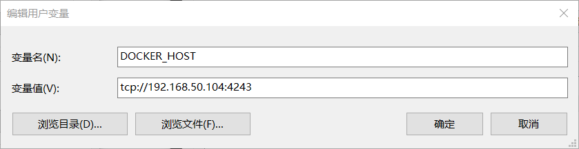

## enable Docker remote API
[How to enable Docker Remote API](https://github.com/jethroau/blogs/blob/master/Docker/remote-api.md)

## set Docker_HOST 
By default the plugin will try to connect to docker on localhost:xxxx. 
Set the DOCKER_HOST environment variable to connect elsewhere.

DOCKER_HOST=tcp://127.0.0.1:4243

## pom.xml
```maven
<properties>
	<docker.image.prefix>springboot</docker.image.prefix>
</properties>

<build>
	<plugins>
		<plugin>
			<groupId>com.spotify</groupId>
			<artifactId>docker-maven-plugin</artifactId>
			<version>1.0.0</version>
			<configuration>
				<imageName>${docker.image.prefix}/${project.artifactId}</imageName>
				<dockerDirectory>${project.basedir}/src/main/docker</dockerDirectory>
				<resources>
					<resource>
						<targetPath>/</targetPath>
						<directory>${project.build.directory}</directory>
						<include>${project.build.finalName}.jar</include>
					</resource>
				</resources>
			</configuration>
		</plugin>
	<plugins>	
</build>
```

## src/main/docker/Dockerfile
```docker
FROM openjdk:8-jdk-alpine
VOLUME /tmp
ADD ja-springboot-hello-1.0.jar app.jar
ENTRYPOINT ["java","-Djava.security.egd=file:/dev/./urandom","-jar","/app.jar"]
```

## set authenticiation for privite docker registry
```
docker login xxxx.domain.registry

cd ~
mkdir .docker
cd .docker
sudo cp  /root/.docker/config.json ./
sudo chown ~(jenkins) config.json
```
* Since version 1.0.0, the docker-maven-plugin will automatically use any authentication present in the docker-cli configuration file at ~/.dockercfg or ~/.docker/config.json, without the need to configure anything   
https://github.com/spotify/docker-maven-plugin#authenticating-with-private-registries  


## $MAVEN_HOME/conf/setting.xml
```xml
<pluginGroups>  
    <pluginGroup>com.spotify</pluginGroup>  
</pluginGroups>
```

## build docker image
````
mvn clean package docker:build
````


## run docker image
```
docker run -p 80:8080 -t springboot/spp_springboot_hello
```
> **-p** public port : docker internal port, publish docker inernal service to outside prot
> **-t** Allocate a pseudo-TTY, open terminal when runs docker image

```
 docker run -p 80:8080 -d --name springboot-hello springboot/spp_springboot_hello 
```
> **-d** run as a backgroup job

```
 docker ps
 docker stop springboot-hello
 ```
 
 ## remote build
 ADD DOCKER_HOST environment variable 
 > enable your docker remote api first if you have not.
 

 

## reference
http://www.ityouknow.com/springboot/2018/03/19/spring-boot-docker.html
http://www.cnblogs.com/rongfengliang/p/6669152.html  
https://blog.csdn.net/lvyuan1234/article/details/69255944  
https://github.com/spotify/docker-maven-plugin

## push to private hub
https://blog.csdn.net/hxpjava1/article/details/79695529


