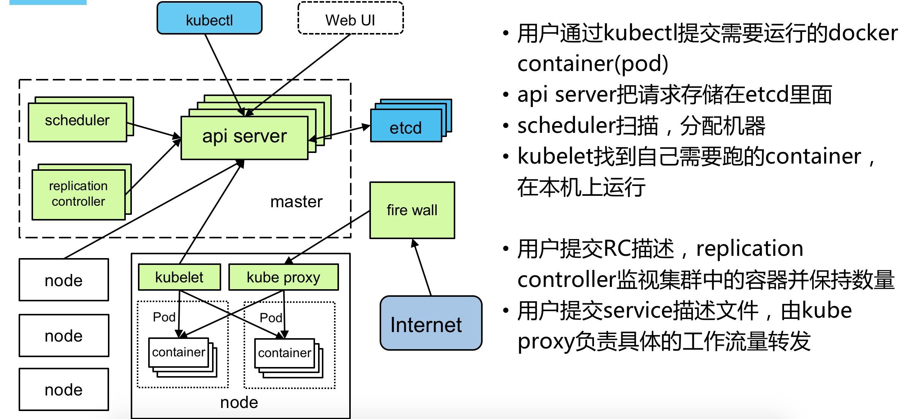

## Kubeneters Architecture


## Key compoents
Kubernetes节点分为master和node两大类，master节点部署Api-server、Scheduler、Replication-Controller、etcd，node节点部署Kubelet、Kube-proxy、docker。Pod是Kubernetes的基本操作单元，由一个或多个容器组成，一般运行相同的应用。Services是服务的抽象，对外提供单一访问端口，后端由多个Pod组成，由Kube-proxy将外部请求分发到后端容器相应的endpoints。Replication-Controller确保任何时候Kubernetes集群中有指定数量的Pod副本在运行。   


### etcd 
Etcd是一个分布式的高性能key-value存储系统，负责Kubernetes中所有REST API对象的持久化保存。  

### kube-apiserver
Kubernetes对外提供统一的入口，通过REST API的方式供客户端调用，例如kubectl。  

### kube-controller-manager
控制集群中程序任务的后台线程。逻辑上，每个控制任务对应一个线程，包括Node Controller、Replication Controller、Service Controller、Endpoints Controller等。  

### kube-scheduler  
维护可用的node节点及资源列表，根据输入的待调度pod请求，通过调度算法选择最优node节点，输出绑定了pod的node节点。

### kubelet  
Kubelet是Kubernetes集群中每个node和Api-server的连接点，负责容器和pod的实际管理工作。

### kube-proxy  
为pod提供代理服务，用来实现 kubernetes 的 service 机制。

### node
A node is a worker machine in Kubernetes, previously known as a minion. A node may be a VM or physical machine, depending on the cluster. Each node contains the services necessary to run pods and is managed by the master components

### pod
A pod (as in a pod of whales or pea pod) is a group of one or more containers (such as Docker containers), with shared storage/network, and a specification for how to run the containers.   

### replicationControler (RC), ReplicaSet, Deployment
* A ReplicationController ensures that a specified number of pod replicas are running at any one time.  
* ReplicaSet is the next-generation Replication Controller. The only difference between a ReplicaSet and a Replication Controller right now is the selector support. 
* A Deployment controller provides declarative updates for Pods and ReplicaSets.  

### service
### volume & Persistent Volume (PV)
### namespace

## Kubectl operation samples 
### Create
```
kubectl create -f xxx-service.yaml -f xxx-rc.yaml
kubectl create -f <directory> //auto load *.yaml 
```

### Get
```
kubectl get node
kubectl get pods
kubectl get rc
kubectl get service
```

### Describe
```
kubectl describe node <node-name>
kubectl describe pod <pod-name>
```

### Delete 
```
kubectl delete -f pod.yaml
kubectl delete pods, service -l name=<label-name>
kubectl delete pods --all
```

### Exec
```
kubectl exec <pod-name> date
kubectl exec -ti <pod-name> -c <container-name> /bin/bash  //login container
```

### Logs
```
kubectl logs <pod-name>
```

### Misc 
```
kubectl get nodes
kubectl describe node <node-name> 

kubectl get pods [--namespace=xxx]
kubectl describe pod <pod-name>
kubectl exec -ti <pod-name> -c <container-name> /bin/bash
kubectl log <pod-name>
kubectl log <pod-name> -c <container-name>

kubectl get endpoints

kubectl get deployments
kubectl get rs
kubectl describe deployments

kubectl get service
kubectl get service <service-name> -o yaml

kubectl get namespaces

```
>  PodIP + containerPort = endpoint  
>  Pod Volume = all containers volume in a Pod  
>  resource:{request:{cpu:?m, memory:?Mi}, limit:{cpe:?m, memory:?Mi}}, CPU: 100m = 0.1 CPU,  Memory: 128Mi = 128Mib   
>  Label and Label Selector {matchLabeles, matchExpressions}   
>  ReplicaSet and RelicationController, ReplicaSet label support Selector  
>  Deployment replace ReplicaSet and RC  
> NodeIP: physical ip address and can be access by public  
> PodIP: endpoints ip address and can be access within Pod   
> ClusterIP： service ip address and can be access within cluster.   
>

### deploy 
```
kubectl apply -f xxx.yml
kubectl create -f xxx.yaml
kubectl get deployments
kubectl set image deployment azure-vote-front azure-vote-front=<acrLoginServer>/azure-vote-front:v2
kubectl set image deployment nginx-deployment nginx=nginx:1.9.1
```


### Scale
```
kubectl scale --replica=3 deployment/<container-name>  
kubectl sacle rc <rc-name> --replica=? 
kubectl autoscale deployment <deployment-name> --cpu-percent=50 --min=2 --max=10
kubectl get hpa
```
> hpa = horizontl pod autoscaling 
>
>

## Official reference. 
[Kubernetes Concepts](https://kubernetes.io/docs/concepts/)  
[Kubernetes Workload/Controller/Deployment](https://kubernetes.io/zh/docs/concepts/workloads/controllers/deployment/)  
