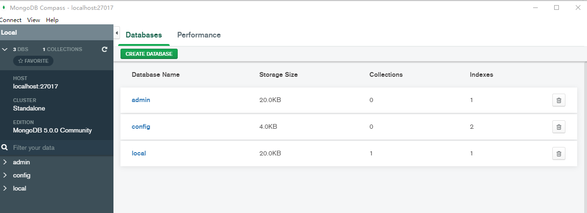

 ## Download MongoDB and install
 
 https://www.mongodb.com/try/download/community
 
 1. download windows msi and click the setup file 
 2. configure mongodb as a windows serivce. 
 
 ## Open MongoDB compass 
 
 1. open compass and connect to local mongoDB by default setting
 
