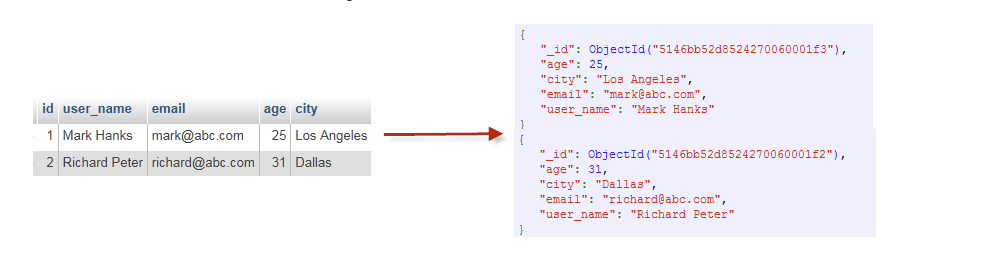

 ## Download MongoDB and install
 
 https://www.mongodb.com/try/download/community
 
 1. download windows msi and click the setup file 
 2. configure mongodb as a windows serivce. 
 
 ## Open MongoDB compass 
  open compass and connect to local mongoDB by default setting   
   
https://blog.csdn.net/mrjkzhangma/article/details/90082178  

## Download Robo3T
https://robomongo.org/  

## MongoDB concept VS SQL DB
[MongoDB] database => collection => document => field  
[SQL DB] database => table => row => column  
   

## Reference docs
https://www.w3cschool.cn/mongodb/mongodb-window-install.html

