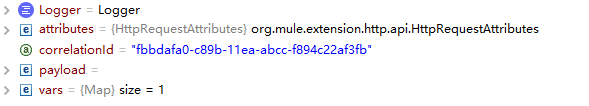
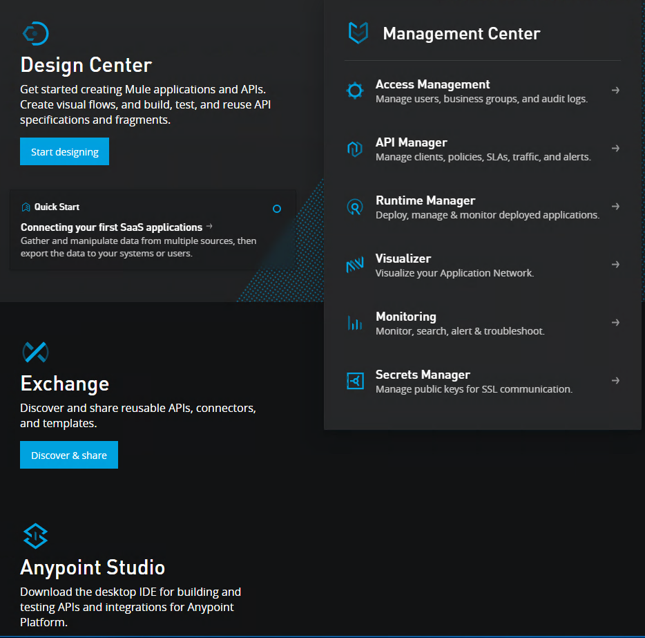

## payload, attributes, vars. 


## For Each Scope 
For Each does not modify the current payload. The output payload is the same as the input.  
https://docs.mulesoft.com/mule-runtime/4.3/for-each-scope-concept 

While "vars" is global scope, For Each will modify vars.   


## mainFlow vs subFlow
In HTTP Request, subFlow can retrieve mainFlow `payload` only.   
After HTTP request, subFlow will return subflow `payload` to mainFlow. mainFlow `variable` still exists but mainFlow attribute will be lost.   
In FlowReference, MainFlow and SubFlow can retrieve `payload, variable and QueryString/Params`.   

## Erorr handling
1. on-error-propagate  
don't handle excpetion and throws exception to outside   

2. on-error-continue  
handle this exception and return http code 200  
https://docs.mulesoft.com/mule-runtime/4.3/try-scope-concept  

https://docs.mulesoft.com/mule-runtime/4.2/intro-error-handlers#error_handlers 


## Configuring Properties
use Ant-style property placeholders, likes ${xxx.xxx}
1. create a properties file under src/main/resources, such as config.yaml
```
training: 
  host: "127.0.0.1"
  port: "8083"
  basepath: "/"
  protocol: "HTTP"  
```
2. in Global Elements sheet, create Global configurations and select file "config.yaml"  
3. edit HTTP Listener config, input ${training.port} for port value.  

## JMS publish vs publish consume
1. `publish` operation can be used also to publish a Message to a given Topic destination and `NO wait` for a reply
2. `publish-consume` operation lets you publish a message to any destination, and then `wait for a reply` on a different destination.  
https://docs.mulesoft.com/jms-connector/1.7/jms-publish-consume  


## FTP Connector 

The “Read” operation of the FTP connector does not have function on deleting or moving files. It could only lock files but it is off by default. But the “On New or Updated File” operation is able to delete, move or rename the file after processing.  

```xml
<ftp:read path="#[path]"
  lock="true|false"
  outputEncoding="UTF-8"
  outputMimeType="application/xml" />

<flow name="onNewFile">
    <ftp:listener config-ref="file" directory="test-data/in" autoDelete="true">
      <scheduling-strategy>
        <fixed-frequency frequency="1000"/>
      </scheduling-strategy>
    </ftp:listener>

    <flow-ref name="processFile" />
</flow>
```

https://docs.mulesoft.com/ftp-connector/1.5/ftp-read  
https://docs.mulesoft.com/ftp-connector/1.5/ftp-on-new-file  

## Lookup 
```xml
<flow name="flow1">
  <http:listener doc:name="Listener" config-ref="HTTP_Listener_config"
    path="/source"/>
  <ee:transform doc:name="Transform Message" >
    <ee:message >
      <ee:set-payload ><![CDATA[%dw 2.0
output application/json
---
Mule::lookup('flow2', {test:'hello '})]]></ee:set-payload>
    </ee:message>
  </ee:transform>
</flow>
<flow name="flow2" >
  <set-payload value='#[payload.test ++ "world"]' doc:name="Set Payload" />
  <logger level="INFO" doc:name="Logger" message='#[payload]'/>
</flow>
```

https://docs.mulesoft.com/mule-runtime/4.3/dw-mule-functions-lookup  

## DataWeave
### QuickStart 
https://docs.mulesoft.com/mule-runtime/4.3/dataweave-quickstart#step_4  

### define functions
```
%dw 2.0
output application/json
fun toUpper(aString) = upper(aString)
---
toUpper("h" ++ "el" ++ lower("LO") )
```
https://docs.mulesoft.com/mule-runtime/4.3/dataweave-functions  

### XML selectors 
The DataWeave script selects the value of the name attribute from the input payload (<user name="Weave"/>). Notice that the @ indicates an attribute selection.
```
%dw 2.0
output application/json
---
payload.user.@name
```
https://docs.mulesoft.com/mule-runtime/4.2/dataweave-selectors  

### Creating and Using a Custom Module
Assume that you have created the MyMapping.dwl file in /src/main/resources/modules that contains this script.  

* A custom module file can only contain `var, fun, type, and ns` declarations
* Imports the module MyModule through the import directive in the header. In this case, the imported module is stored in a Studio project path src/main/resources/modules/MyModule.dwl
* Calls a function in MyModule by using `MyModule::myFunc("dataweave")`.

```
##Example: Custom DataWeave Module
%dw 2.0
fun myFunc(myInput: String) = myInput ++ "_"
var name = "MyData"
ns mynamespace http://acme.com/bar

## Example: Importing and Using a Custom DataWeave Module
%dw 2.0
import modules::MyModule
output application/json
---
MyModule::myFunc("dataweave") ++ "name"
```
https://docs.mulesoft.com/mule-runtime/latest/dataweave-create-module  

### Map Data with DataWeave
```
%dw 2.0
output application/json
---
items: payload.books map ((item, index) -> {
      category: "book",
      price: item.price as Number,
      id: index,
      properties: {
        title: item.title,
        author: item.author,
        year: item.year as Number
      }
   }
)
```
https://docs.mulesoft.com/mule-runtime/4.3/dataweave-cookbook-map  

## API Manager, Proxy and Gateway. 
Through the Autodiscovery scheme, API Manager can track the API throughout the life cycle as you modify, version, deploy, govern, and publish it. API Manager 2.x is tightly integrated with the following tools:

* `Design Center` for creating the RAML structure of the API
* `Exchange` for storing and publishing API assets
* `Studio` for implementing the API

API proxies, also known as "autogenerated proxies", are meant to enhance the usability of API Manager in your Mule application.  




https://dzone.com/articles/proxying-with-api-manager  
https://docs.mulesoft.com/api-manager/2.x/api-proxy-landing-page  

## Object Stores
Store Application Data Using Object Stores
An object store is a facility for storing objects in or across Mule applications. Mule runtime engine (Mule) uses `object stores to persist data` for eventual retrieval.  
https://docs.mulesoft.com/mule-runtime/4.3/mule-object-stores  


## RAML 
###

### Using !include
To modularize the API definition, RAML provides several mechanisms, one of which is the `!include` property. To keep the API definition concise, you can include external content, such as documentation, schemas, and frequently used patterns outside the definition itself. The parser interprets `!include` as if the content of the externally-hosted file or a URL were declared in-line.  
```
      application/json:
        example: !include user-example.json
```
