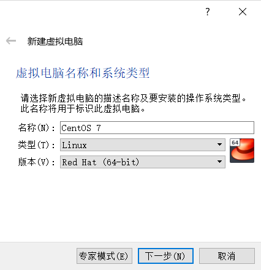
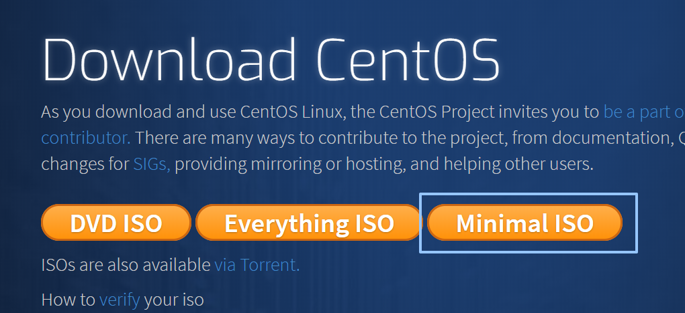
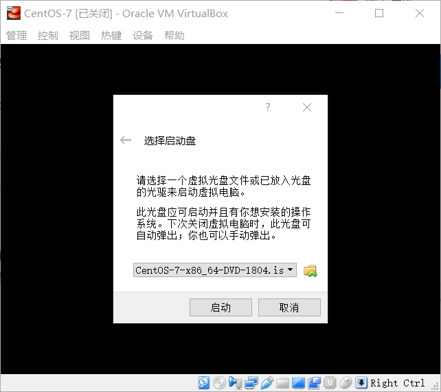
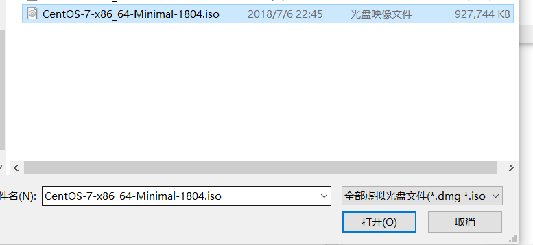
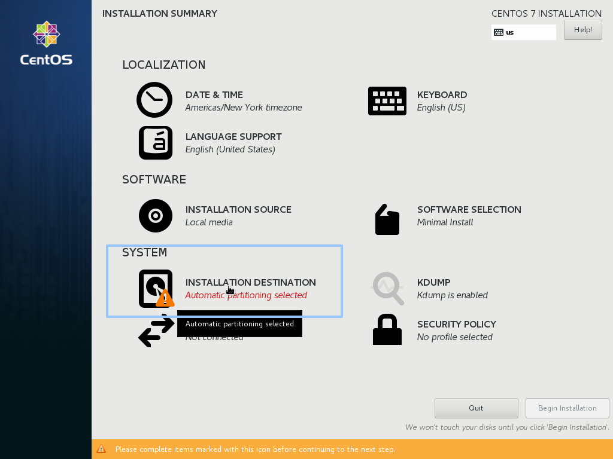
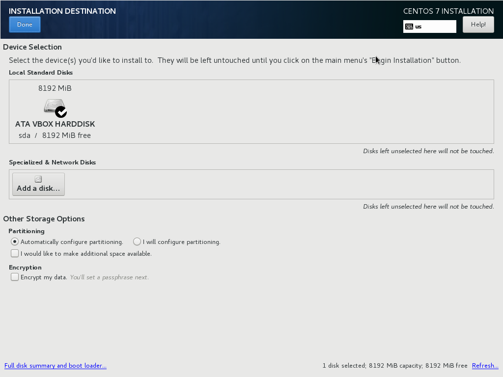
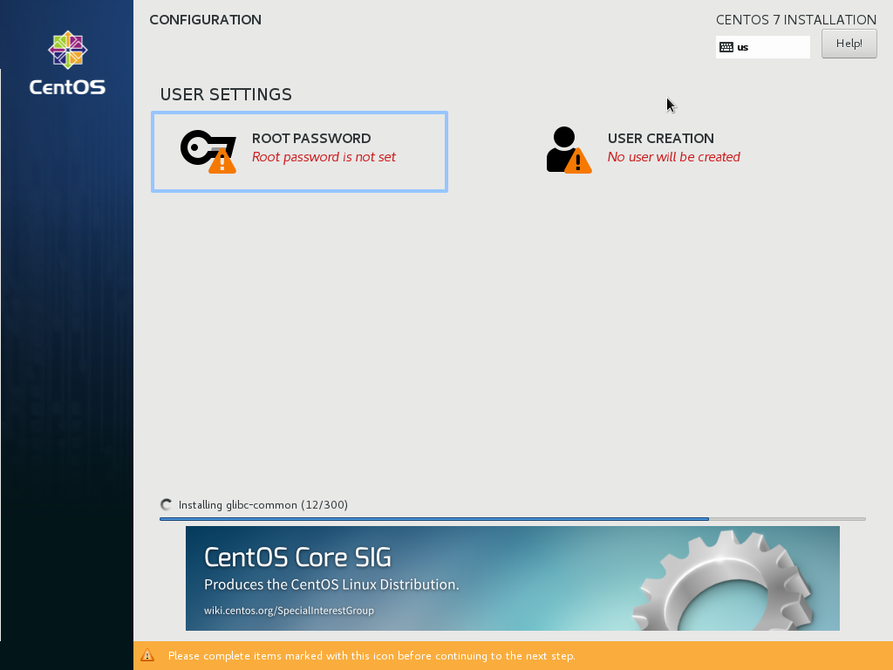
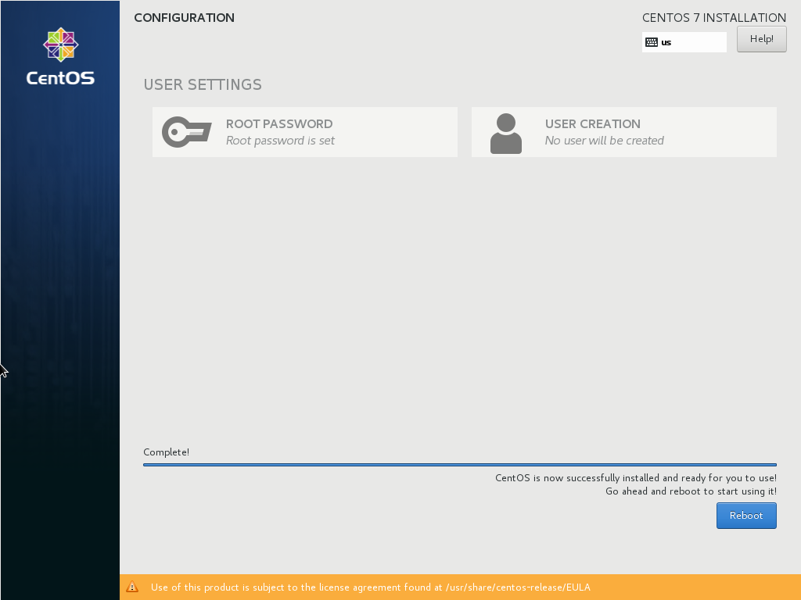
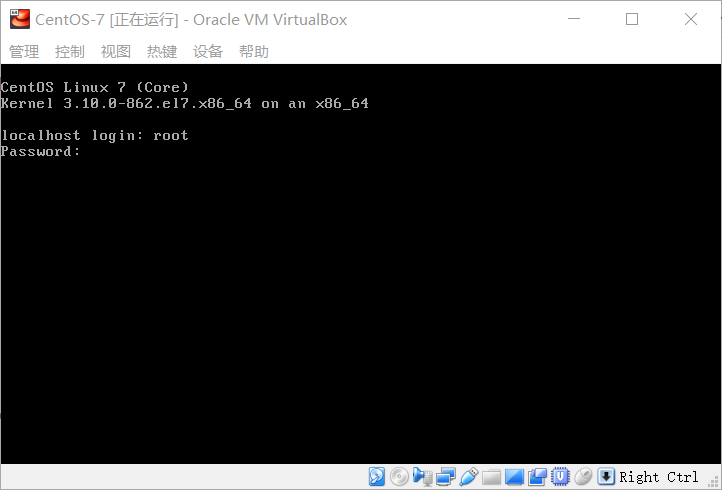
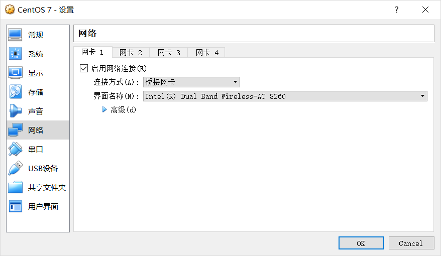

## Install CentOS 7 
Click "New" to create a Virtual machines   

Click "Start" to install  

Open chrome to download CentOS 7 Minimal ISO file from [https://www.centos.org/download/](https://www.centos.org/download/)  

Client "folder" button   

Select ISO file path   

Click "Installation Destination"  

Click "Done" and confirm the destination VDI you created in previous steps during a VM creation.   

Enter your root password  

Click "Reboot" after installation is completed  

Installation is successful when you see below screen. 

## Network adaptor setting 
Select "bridge net-card" option to get another IP from DHCP server. 

