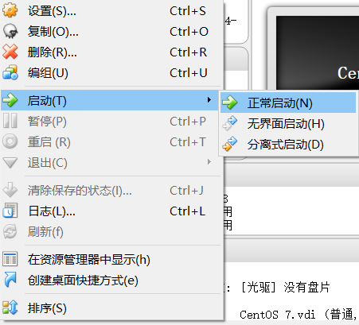

# Create a VM with CentOS and enable Internet connection.

## Install CentOS 7 
Click "New" to create a Virtual machines   


Click "Start" to install  


Open chrome to download CentOS 7 Minimal ISO file from [https://www.centos.org/download/](https://www.centos.org/download/)  


Client "folder" button   


Select ISO file path   


Click "Installation Destination"  


Click "Done" and confirm the destination VDI you created in previous steps during a VM creation.   


Enter your root password  


Click "Reboot" after installation is completed  


Installation is successful when you see below screen. 


## disable firewall servcie 
```
systemctl stop firewalld
reboot
```

## Network adaptor setting to bridge (using router to connect internet)
Select "bridge net-card" option to get another IP from DHCP server. 


## Set Host-only network adapter (using direct Lan to connect internet)

Click "Host-Network-Manager" and create a new Host-Only Network adapter for your PC


Open your VM setting, enable netowrk connection to "Host-only" and select the adapter you created at previous step


Open "PC netowrk & internet" setting and right click ethernet icon
 

change to share tab and enable Internet share open and select the VB network adapter 

