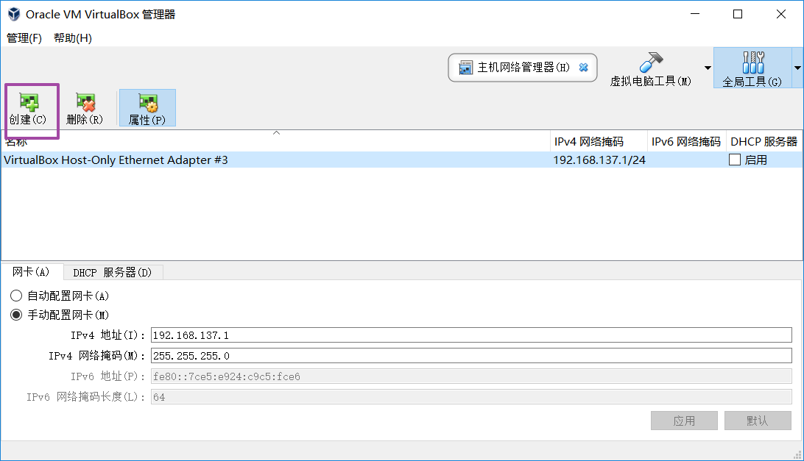
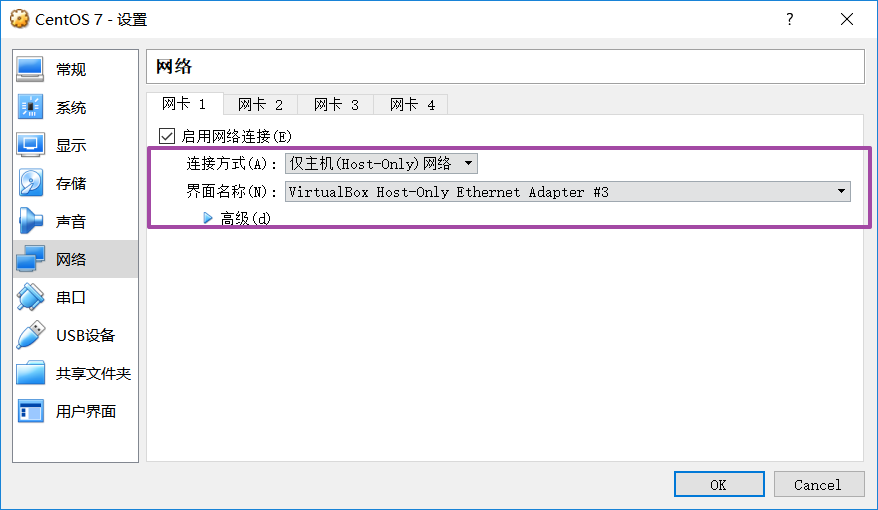
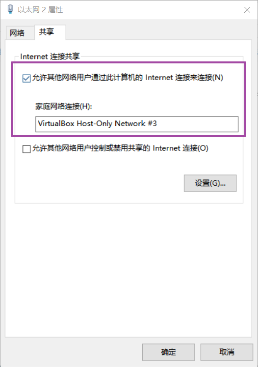

# Set Host-only network adapter

## Click "Host-Network-Manager" and create a new Host-Only Network adapter for your PC

## Client your VM setting and enable netowrk connection to "Host-only" and select the adapter you created at previous step

## Open "PC netowrk & internet" setting and right click ethernet icon
 

## change to share tab and enable Internet share open and select the VB network adapter 

## netcard setting 

https://blog.csdn.net/hzhsan/article/details/45224371  
https://blog.csdn.net/wyh9459/article/details/53559993
