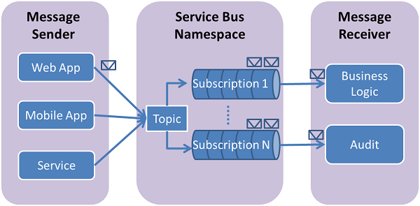

# AZ-203
[Developer learning path](https://docs.microsoft.com/en-us/learn/browse/?products=azure&roles=developer&resource_type=learning%20path)  
[Self-paced diagram](https://query.prod.cms.rt.microsoft.com/cms/api/am/binary/RWtQqM)  

> 考试范围
> https://www.microsoft.com/zh-cn/learning/exam-AZ-203.aspx   

## Azure sandbox
https://docs.microsoft.com/en-us/learn/modules/create-cosmos-db-for-scale/2-create-an-account  


# Key content and Practice
## Azure Search
The process of creating an Azure Search index using C# and the .NET SDK. Index creation is accomplished by performing these tasks:
* Create a SearchServiceClient object to connect to a search service.  
* Create an Index object to pass as a parameter to Indexes.Create.  
* Call the Indexes.Create method on SearchServiceClient to send the Index to a service. 

Import data into an Azure Search index using C# and the .NET SDK. Pushing documents into your index is accomplished by performing these tasks:
* Create a SearchIndexClient object to connect to a search index. 
* Create an IndexBatch object containing the documents to be added, modified, or deleted. 
* Call the Documents.Index method on SearchIndexClient to upload documents to an index. 

> https://docs.microsoft.com/en-us/azure/search/search-import-data-dotnet 

## Azure Table Storage
Generates a property filter condition string for the string value.
```C#
public static string GenerateFilterCondition (string propertyName, string operation, string givenValue);

Parameters
propertyName
String
A string containing the name of the property to compare.

operation
String
A string containing the comparison operator to use.

givenValue
String
A string containing the value to compare with the property.

Returns
String
A string containing the formatted filter condition.
```
> https://docs.azure.cn/zh-cn/dotnet/api/microsoft.windowsazure.storage.table.tablequery.generatefiltercondition?view=azure-dotnet

## CosMosDB Consistency level 

* Strong: **Strong consistency offers a linearizability guarantee**. The reads are guaranteed to return the most recent committed version of an item. A client never sees an uncommitted or partial write. Users are always guaranteed to read the latest committed write. 

* Bounded staleness: The reads are guaranteed to honor the consistent-prefix guarantee. The reads might lag behind writes by at most "K" versions (i.e., "updates") of an item or by "T" time interval. In other words, when you choose bounded staleness, the "staleness" can be configured in two ways:  
The number of versions (K) of the item  
The time interval (T) by which the reads might lag behind the writes  

* Session: The reads are guaranteed to honor the consistent-prefix (assuming a single “writer” session), monotonic reads, monotonic writes, read-your-writes, and write-follows-reads guarantees. **Session consistency is scoped to a client session.** 

* Consistent prefix: Updates that are returned contain some prefix of all the updates, with no gaps. Consistent prefix consistency level guarantees that **reads never see out-of-order writes.** 

* Eventual: There's no ordering guarantee for reads. In the absence of any further writes, **the replicas eventually converge.** 
> https://docs.microsoft.com/en-us/azure/cosmos-db/consistency-levels


## Azure Table Storage SDK (.NET)
**Create a Table**  
The CloudTableClient class enables you to retrieve tables and entities stored in Table storage. Because we don’t have any tables in the Cosmos DB Table API account, let’s add the CreateTableAsync method to the Common.cs class to create a table:
```C#
public static async Task<CloudTable> CreateTableAsync(string tableName)
  {
    // Create a table client for interacting with the table service
    CloudTableClient tableClient = storageAccount.CreateCloudTableClient(new TableClientConfiguration());
    CloudTable table = tableClient.GetTableReference(tableName);
    await table.CreateIfNotExistsAsync()
}
```
**Define the entity**  
This code defines an entity class that uses the customer's first name as the row key and last name as the partition key. Together,**an entity's partition and row key uniquely identify it in the table**. Entities with the same partition key can be queried faster than entities with different partition keys but using diverse partition keys allows for greater scalability of parallel operations. Entities to be stored in tables must be of a supported type, for example **derived from the TableEntity class**. Entity properties you'd like to store in a table must be public properties of the type, and support both getting and setting of values. Also, your entity type must expose a parameter-less constructor.

```C#
namespace CosmosTableSamples.Model
{
    using Microsoft.Azure.Cosmos.Table;
    public class CustomerEntity : TableEntity
    {
        public CustomerEntity()
        {
        }

        #表服务使用 PartitionKey 在存储节点中智能分发。 具有相同的 PartitionKey 的实体存储在同一个节点上。 RowKey 是实体在其所属分区内的唯一 ID。  
        public CustomerEntity(string lastName, string firstName)
        {
            PartitionKey = lastName;
            RowKey = firstName;
        }

        public string Email { get; set; }
        public string PhoneNumber { get; set; }
    }
}
```

**Insert or merge an entity**  
The following code example creates an entity object and adds it to the table. The **InsertOrMerge** method within the **TableOperation** class is used to insert or merge an entity. The **CloudTable.ExecuteAsync** method is called to execute the operation.
```C#
public static async Task<CustomerEntity> InsertOrMergeEntityAsync(CloudTable table, CustomerEntity entity)    {
       // Create the InsertOrReplace table operation
       TableOperation insertOrMergeOperation = TableOperation.InsertOrMerge(entity);
       
       // Execute the operation.
       TableResult result = await table.ExecuteAsync(insertOrMergeOperation);
       
       CustomerEntity insertedCustomer = result.Result as CustomerEntity;
}
```

**Get an entity from a partition**  
You can get entity from a partition by using the Retrieve method under the TableOperation class. The following code example gets the partition key row key, email and phone number of a customer entity. 
```C#
public static async Task<CustomerEntity> RetrieveEntityUsingPointQueryAsync(CloudTable table, string partitionKey, string rowKey)
        
        TableOperation retrieveOperation = TableOperation.Retrieve<CustomerEntity>(partitionKey, rowKey);
        TableResult result = await table.ExecuteAsync(retrieveOperation);
        CustomerEntity customer = result.Result as CustomerEntity;

        return customer;
}
```

**Delete an entity**  
```C#
public static async Task DeleteEntityAsync(CloudTable table, CustomerEntity deleteEntity)
{
    TableOperation deleteOperation = TableOperation.Delete(deleteEntity);
    TableResult result = await table.ExecuteAsync(deleteOperation);
}
```
> https://docs.microsoft.com/en-us/azure/cosmos-db/tutorial-develop-table-dotnet


## Azure batch

### Create a pool of compute nodes 

#### .NET SDK
To create a Batch pool, the app uses the **BatchClient.PoolOperations.CreatePool** method to set the number of nodes, VM size, and a pool configuration.   
```c#
private static VirtualMachineConfiguration CreateVirtualMachineConfiguration(ImageReference imageReference)
{
    return new VirtualMachineConfiguration(
        imageReference: imageReference,
        nodeAgentSkuId: "batch.node.windows amd64");
}

private static ImageReference CreateImageReference()
{
    return new ImageReference(
        publisher: "MicrosoftWindowsServer",
        offer: "WindowsServer",
        sku: "2016-datacenter-smalldisk",
        version: "latest");
}

private static void CreateBatchPool(BatchClient batchClient, VirtualMachineConfiguration vmConfiguration)
{
    try
    {
        CloudPool pool = batchClient.PoolOperations.CreatePool(
            poolId: PoolId,
            targetDedicatedComputeNodes: PoolNodeCount,
            virtualMachineSize: PoolVMSize,
            virtualMachineConfiguration: vmConfiguration);

        pool.Commit();
    }
...
```
#### Python SDK
To create a Batch pool, the app uses the **PoolAddParameter** class to set the number of nodes, VM size, and a pool configuration.
```python
new_pool = batch.models.PoolAddParameter(
    id=pool_id,
    virtual_machine_configuration=batchmodels.VirtualMachineConfiguration(
        image_reference=batchmodels.ImageReference(
            publisher="Canonical",
            offer="UbuntuServer",
            sku="18.04-LTS",
            version="latest"
            ),
        node_agent_sku_id="batch.node.ubuntu 18.04"),
    vm_size=config._POOL_VM_SIZE,
    target_dedicated_nodes=config._POOL_NODE_COUNT
)
batch_service_client.pool.add(new_pool)
```

### Create a Batch job
#### .NET SDK
The app uses the **BatchClient.JobOperations.CreateJob** method to create a job on your pool. The **Commit** method submits the job to the Batch service.   
```c#
try
{
    CloudJob job = batchClient.JobOperations.CreateJob();
    job.Id = JobId;
    job.PoolInformation = new PoolInformation { PoolId = PoolId };

    job.Commit();
}
...
```
#### Python SDK
The app uses the **JobAddParameter** class to create a job on your pool. The **job.add** method submits the pool to the Batch service.   

### Create tasks
#### .NET SDK
The app creates a list of **CloudTask** objects. Then, the app adds tasks to the job with the **AddTask** method, which queues them to run on the compute nodes.   

```c#
// Create a collection to hold the tasks added to the job.
List<CloudTask> tasks = new List<CloudTask>();

for (int i = 0; i < inputFiles.Count; i++)
{
    string taskId = String.Format("Task{0}", i);

    // Define task command line to convert each input file.
    string appPath = String.Format("%AZ_BATCH_APP_PACKAGE_{0}#{1}%", appPackageId, appPackageVersion);
    string inputMediaFile = inputFiles[i].FilePath;
    string outputMediaFile = String.Format("{0}{1}",
        System.IO.Path.GetFileNameWithoutExtension(inputMediaFile),
        ".mp3");
    string taskCommandLine = String.Format("cmd /c {0}\\ffmpeg-3.4-win64-static\\bin\\ffmpeg.exe -i {1} {2}", appPath, inputMediaFile, outputMediaFile);

    // Create a cloud task (with the task ID and command line)
    CloudTask task = new CloudTask(taskId, taskCommandLine);
    task.ResourceFiles = new List<ResourceFile> { inputFiles[i] };

    // Task output file
    List<OutputFile> outputFileList = new List<OutputFile>();
    OutputFileBlobContainerDestination outputContainer = new OutputFileBlobContainerDestination(outputContainerSasUrl);
    OutputFile outputFile = new OutputFile(outputMediaFile,
       new OutputFileDestination(outputContainer),
       new OutputFileUploadOptions(OutputFileUploadCondition.TaskSuccess));
    //- OutputFileUploadCondition.TASK_COMPLETION	
    //Upload the file(s) after the task process exits, no matter what the exit code was.  
    //- OutputFileUploadCondition.TASK_FAILURE	
    //Upload the file(s) only after the task process exits with a nonzero exit code.  
    //- OutputFileUploadCondition.TASK_SUCCESS	
    //Upload the file(s) only after the task process exits with an exit code of 0.  

    outputFileList.Add(outputFile);
    task.OutputFiles = outputFileList;
    tasks.Add(task);
}

// Add tasks as a collection
await batchClient.JobOperations.AddTaskAsync(jobId, tasks);
return tasks
```
#### Python SDK
The app creates a list of task objects using the **TaskAddParameter** class. Then, the app adds tasks to the job with the **task.add_collection** method, which queues them to run on the compute nodes.  

> https://docs.microsoft.com/en-us/azure/batch/quick-run-dotnet

## Deploy an Azure Kubernetes Service (AKS) cluster using the Azure CLI

### Create a resource group
```
az group create --name myResourceGroup --location eastus
```
### Create AKS cluster
```
az aks create \
    --resource-group myResourceGroup \
    --name myAKSCluster \
    --node-count 1 \
    --enable-addons monitoring \
    --generate-ssh-keys
```
### Connect to the cluster
```
az aks get-credentials --resource-group myResourceGroup --name myAKSCluster
kubectl get nodes
```
### Run the application
```
kubectl apply -f azure-vote.yaml
```
### Test the application
```
kubectl get service azure-vote-front --watch
```

> https://docs.microsoft.com/en-us/azure/aks/kubernetes-walkthrough

## Web App AutoScale
Step 1: Configure the web app to the Standard App Service Tier  
The Standard tier supports auto-scaling, and we should minimize the cost.  
Step 2: Enable autoscaling on the web app  
First enable autoscale  
Step 3: Add a scale rule  
Step 4: Add a Scale condidation  

> https://docs.microsoft.com/en-us/azure/azure-monitor/platform/autoscale-get-started
> https://azure.microsoft.com/en-us/pricing/details/app-service/plans/

## Azure CDN overview
### How it works. 
1. A user (Alice) requests a file (also called an asset) by using a URL with a special domain name, such as <endpoint name>.azureedge.net. This name can be an endpoint hostname or a custom domain. The DNS routes the request to the best performing POP location, which is usually the POP that is geographically closest to the user.

2. If no edge servers in the POP have the file in their cache, the POP requests the file from the origin server. The origin server can be an Azure Web App, Azure Cloud Service, Azure Storage account, or any publicly accessible web server.

3. The origin server returns the file to an edge server in the POP.

4. An edge server in the POP caches the file and returns the file to the original requestor (Alice). The file remains cached on the edge server in the POP until the time-to-live (TTL) specified by its HTTP headers expires. If the origin server didn't specify a TTL, the default TTL is seven days.

5. Additional users can then request the same file by using the same URL that Alice used, and can also be directed to the same POP.

6. If the TTL for the file hasn't expired, the POP edge server returns the file directly from the cache. This process results in a faster, more responsive user experience.  


> https://docs.microsoft.com/en-us/azure/cdn/cdn-overview

## Logic Apps

### Logic Apps Designer
After Azure deploys your app, the Logic Apps Designer opens and shows a page with an introduction video and commonly used triggers. Under Templates, choose Blank Logic App. 
> https://docs.microsoft.com/en-us/azure/logic-apps/quickstart-create-first-logic-app-workflow

### Enterprise Integration Pack
You can build and manage B2B apps with the Enterprise Integration Pack through the Logic App Designer in the Azure portal. 
> https://docs.microsoft.com/en-us/azure/logic-apps/logic-apps-enterprise-integration-overview

### Code View editor
To work with logic app definitions in JSON, open the Code View editor when working in the Azure portal or in Visual Studio, or copy the definition into any editor that you want.   
> https://docs.microsoft.com/en-us/azure/logic-apps/logic-apps-author-definitions  

### Event Grid Security 
Custom topic publishing
1. Key authentication: Key authentication is the simplest form of authentication.
2. SAS tokens: SAS tokens for Event Grid include the resource, **an expiration time**, and a signature. 

Event Grid supports two ways of validating the subscription.  
1. ValidationCode handshake (programmatic): If **you control the source code for your endpoint**, this method is recommended. 
2. ValidationURL handshake (manual): In certain cases, you can't access the source code of the endpoint to implement the ValidationCode handshake. 

> https://docs.microsoft.com/en-us/azure/event-grid/security-authentication

## Azure RM powershell

New-AzureRmApiManagementBackend: Creates a new backend entity in Api Management.  
> https://docs.microsoft.com/en-us/powershell/module/azurerm.apimanagement/new-azurermapimanagementbackend?view=azurermps-6.13.0

New-AzureRmApiManagementBackendProxy: Creates a new Backend Proxy Object which can be piped when creating a new Backend entity.  
> https://docs.microsoft.com/en-us/powershell/module/azurerm.apimanagement/new-azurermapimanagementbackendproxy?view=azurermps-6.13.0

New-AzureRmApiManagement: creates an API Management deployment in Azure API Management.  
> https://docs.microsoft.com/en-us/powershell/module/azurerm.apimanagement/new-azurermapimanagement?view=azurermps-6.13.0

New-AzureRmApiManagementApi: creates an Azure API Management API.
> https://docs.microsoft.com/en-us/powershell/module/azurerm.apimanagement/new-azurermapimanagementapi?view=azurermps-6.13.0 

## Servcie Bus Messaging (topic filters)

- Boolean filters - The TrueFilter and FalseFilter either cause all arriving messages (true) or none of the arriving messages (false) to be selected for the subscription.

- SQL Filters - A SqlFilter holds a SQL-like conditional expression that is evaluated in the broker against the arriving messages' user-defined properties and system properties. All system properties must be prefixed with sys. in the conditional expression. The SQL-language subset for filter conditions tests for the existence of properties (EXISTS), as well as for null-values (IS NULL), logical NOT/AND/OR, relational operators, simple numeric arithmetic, and simple text pattern matching with LIKE.

- Correlation Filters - A CorrelationFilter holds a set of conditions that are matched against one or more of an arriving message's user and system properties. A common use is to match against the CorrelationId property, but the application can also choose to match against ContentType, Label, MessageId, ReplyTo, ReplyToSessionId, SessionId, To, and any user-defined properties. A match exists when an arriving message's value for a property is equal to the value specified in the correlation filter. For string expressions, the comparison is case-sensitive. When specifying multiple match properties, the filter combines them as a logical AND condition, meaning for the filter to match, all conditions must match.

> https://docs.microsoft.com/en-us/azure/service-bus-messaging/topic-filters

## Azure API management authentication policies
- Authenticate with Basic - Authenticate with a backend service using Basic authentication.
- Authenticate with client certificate - Authenticate with a backend service using client certificates.
- Authenticate with managed identity - Authenticate with the managed identity for the API Management service.

> https://docs.microsoft.com/en-us/azure/api-management/api-management-authentication-policies

## Azure search from a .NET Application
Two main objects: `SearchServiceClient`, `SearchCredentials`. 
```
private static SearchServiceClient CreateSearchServiceClient(IConfigurationRoot configuration)
{
    string searchServiceName = configuration["SearchServiceName"];
    string adminApiKey = configuration["SearchServiceAdminApiKey"];

    SearchServiceClient serviceClient = new SearchServiceClient(searchServiceName, new SearchCredentials(adminApiKey));
    return serviceClient;
}
```

## Azure Web Service (utilize CLI to create CI/CD via Github)

```
#!/bin/bash

gitrepo=<replace-with-URL-of-your-own-GitHub-repo>
token=<replace-with-a-GitHub-access-token>
webappname=mywebapp$RANDOM

# Create a resource group.
az group create --location chinaeast --name myResourceGroup

# Create an App Service plan in `FREE` tier.
az appservice plan create --name $webappname --resource-group myResourceGroup --sku FREE

# Create a web app.
az webapp create --name $webappname --resource-group myResourceGroup --plan $webappname

# Configure continuous deployment from GitHub. 
# --git-token parameter is required only once per Azure account (Azure remembers token).
az webapp deployment source config --name $webappname --resource-group myResourceGroup \
--repo-url $gitrepo --branch master --git-token $token

# Copy the result of the following command into a browser to see the web app.
echo http://$webappname.chinacloudsites.cn

```
> https://docs.azure.cn/zh-cn/app-service/scripts/cli-continuous-deployment-github

## Azure Application insights
Three of the usage blades use the same tool to slice and dice telemetry from your web app from three perspectives. By filtering and splitting the data, you can uncover insights about the relative usage of different pages and features.

- Users tool: How many people used your app and its features. Users are counted by using anonymous IDs stored in browser cookies. A single person using different browsers or machines will be counted as more than one user.
- Sessions tool: How many sessions of user activity have included certain pages and features of your app. A session is counted after half an hour of user inactivity, or after 24 hours of continuous use.
- Events tool: How often certain pages and features of your app are used. A page view is counted when a browser loads a page from your app, provided you have instrumented it.

A custom event represents one occurrence of something happening in your app, often a user interaction like a button click or the completion of some task. You insert code in your app to generate custom events.

> https://docs.microsoft.com/en-us/azure/azure-monitor/app/usage-segmentation


## Azure WebJob types

### Continuous
- Starts immediately when the WebJob is created. To keep the job from ending, the program or script typically does its work inside an endless loop. If the job does end, you can restart it.	
- Runs on all instances that the web app runs on. You can optionally restrict the WebJob to a single instance.	
- Supports remote debugging.

### Triggered
- Starts only when triggered manually or on a schedule.
- Runs on a single instance that Azure selects for load balancing.
- Doesn't support remote debugging.

> https://docs.microsoft.com/en-us/azure/app-service/webjobs-create

## Azure Role assignment | definition

**az role assignment create**	Create a new role assignment for a user, group, or service principal.   
**az role definition create**	Create a custom role definition.  

**New-AzureRmRoleAssignment**   Assigns the specified RBAC role to the specified principal, at the specified scope.  
**New-AzureRmRoleDefinition**   Creates a custom role in Azure RBAC.   

## LabelMaker
You need to meet the LabelMaker application security requirement.  
Solution:  
1. Place the Azure Active Directory account into an Azure AD group.  
2. Create a ClusterRoleBinding and assign it to the group.  

> http://www.microsoftbraindumps.com/13-mar-2019-update-exam-az-203-vce-dumps-and-az-203-pdf-dumps-from-passleader.html

## Configure TLS mutual authentication for Azure App Service
`Request.header`, `Base64`  
```C#
            //
            // Read the certificate from the header into an X509Certificate2 object
            // Display properties of the certificate on the page
            //
            protected void Page_Load(object sender, EventArgs e)
            {
                NameValueCollection headers = base.Request.Headers;
                certHeader = headers["X-ARR-ClientCert"];
                if (!String.IsNullOrEmpty(certHeader))
                {
                    try
                    {
                        byte[] clientCertBytes = Convert.FromBase64String(certHeader);
                        certificate = new X509Certificate2(clientCertBytes);
                
             ...
```

## Build a custom image and run in App Service from a private registry
```
az group create --name myResourceGroup --location "West Europe"
## create Azure container registry 
az acr create --name <azure-container-registry-name> --resource-group myResourceGroup --sku Basic --admin-enabled true
az acr credential show --name <azure-container-registry-name>
# docker tag, push
az acr repository list -n <azure-container-registry-name>

## create app servcie for container
az appservice plan create --name myAppServicePlan --resource-group myResourceGroup --sku B1 --is-linux
az webapp create --resource-group myResourceGroup --plan myAppServicePlan --name <app-name> --deployment-container-image-name <azure-container-registry-name>.azurecr.io/mydockerimage:v1.0.0
az webapp config container set --name <app-name> --resource-group myResourceGroup --docker-custom-image-name <azure-container-registry-name>.azurecr.io/mydockerimage:v1.0.0 --docker-registry-server-url https://<azure-container-registry-name>.azurecr.io --docker-registry-server-user <registry-username> --docker-registry-server-password <password>
az webapp config appsettings set --resource-group myResourceGroup --name <app-name> --settings WEBSITES_PORT=8000
```
> https://docs.microsoft.com/en-us/azure/app-service/containers/tutorial-custom-docker-image

## Push notification windows phone
```
 // Define the notification hub.
NotificationHubClient hub = NotificationHubClient.CreateClientFromConnectionString("<connection string with full access>", "<hub name>");

var toast = @"<toast><visual><binding template=""ToastText01""><text id=""1"">" +
                        "From " + user + ": " + message + "</text></binding></visual></toast>";
outcome = await Notifications.Instance.Hub.SendWindowsNativeNotificationAsync(toast, userTag);
```

> https://docs.azure.cn/zh-cn/dotnet/api/microsoft.azure.notificationhubs.notificationhubclient?view=azure-dotnet


## Offline DAta sync in Azure mobile Apps. 
Incremental Sync:   
To use incremental sync, your server must return meaningful updatedAt values and must also support sorting by this field. 

> https://docs.microsoft.com/en-us/azure/app-service-mobile/app-service-mobile-offline-data-sync

## Azure Functions Core Tools

Install Azure Functions Core Tools version 2.6.666 or later.
Install the Azure CLI. This article requires the Azure CLI version 2.0 or later. 

> https://docs.microsoft.com/en-us/azure/azure-functions/functions-create-first-azure-function-azure-cli


## Azure Table API
```C#
CloudTable table = tableClient.GetTableReference("people");

// Filter against a property that's not partition key or row key
TableQuery<CustomerEntity> emailQuery = new TableQuery<CustomerEntity>().Where(
    TableQuery.GenerateFilterCondition("Email", QueryComparisons.Equal, "Ben@contoso.com"));

foreach (CustomerEntity entity in table.ExecuteQuery(emailQuery))
{
    Console.WriteLine("{0}, {1}\t{2}\t{3}", entity.PartitionKey, entity.RowKey,
        entity.Email, entity.PhoneNumber);
}
```
> https://docs.azure.cn/zh-cn/cosmos-db/tutorial-develop-table-dotnet

## Azure service bus 
Register a message handler which will be invoked every time a message is received.
``
    // Register the function that processes messages.
    queueClient.RegisterMessageHandler(ProcessMessagesAsync, messageHandlerOptions);

    // another example
    queueClient.RegisterMessageHandler(
        async (message, token) =>
        {
            // Process the message
            Console.WriteLine($"Received message: SequenceNumber:{message.SystemProperties.SequenceNumber} Body:{Encoding.UTF8.GetString(message.Body)}");

            // Complete the message so that it is not received again.
            // This can be done only if the queueClient is opened in ReceiveMode.PeekLock mode.
            await queueClient.CompleteAsync(message.SystemProperties.LockToken);
        },
        async (exceptionEvent) =>
        {
            // Process the exception
            Console.WriteLine("Exception = " + exceptionEvent.Exception);
            return Task.CompletedTask;
        });
``
> https://docs.microsoft.com/en-us/azure/service-bus-messaging/service-bus-dotnet-get-started-with-queues 
> https://docs.microsoft.com/en-us/dotnet/api/microsoft.azure.servicebus.queueclient?view=azure-dotnet


## Azure API Management Policy
`set-variable`, `cache-lookup`, `cache-store`, `find-and-replace`
```
<policies>
    <inbound>
        <!-- How you determine user identity is application dependent -->
        <set-variable
          name="enduserid"
          value="@(context.Request.Headers.GetValueOrDefault("Authorization","").Split(' ')[1].AsJwt()?.Subject)" />

        <!--Look for userprofile for this user in the cache -->
        <cache-lookup-value
          key="@("userprofile-" + context.Variables["enduserid"])"
          variable-name="userprofile" />

        <!-- If API Management doesn’t find it in the cache, make a request for it and store it -->
        <choose>
            <when condition="@(!context.Variables.ContainsKey("userprofile"))">
                <!-- Make HTTP request to get user profile -->
                <send-request
                  mode="new"
                  response-variable-name="userprofileresponse"
                  timeout="10"
                  ignore-error="true">

                   <!-- Build a URL that points to the profile for the current end-user -->
                    <set-url>@(new Uri(new Uri("https://apimairlineapi.azurewebsites.net/UserProfile/"),(string)context.Variables["enduserid"]).AbsoluteUri)</set-url>
                    <set-method>GET</set-method>
                </send-request>

                <!-- Store response body in context variable -->
                <set-variable
                  name="userprofile"
                  value="@(((IResponse)context.Variables["userprofileresponse"]).Body.As<string>())" />

                <!-- Store result in cache -->
                <cache-store-value
                  key="@("userprofile-" + context.Variables["enduserid"])"
                  value="@((string)context.Variables["userprofile"])"
                  duration="100000" />
            </when>
        </choose>
        <base />
    </inbound>
    <outbound>
        <!-- Update response body with user profile-->
        <find-and-replace
              from='"$userprofile$"'
              to="@((string)context.Variables["userprofile"])" />
        <base />
    </outbound>
</policies>
```
> https://docs.microsoft.com/zh-cn/azure/api-management/api-management-sample-cache-by-key
> https://docs.microsoft.com/zh-cn/azure/api-management/api-management-caching-policies
> https://docs.microsoft.com/en-us/azure/api-management/api-management-transformation-policies#Findandreplacestringinbody

## Azure API management backend 

> https://docs.microsoft.com/en-us/azure/api-management/api-management-howto-mutual-certificates

## Azure Search SearchParameters

> https://docs.microsoft.com/en-us/dotnet/api/microsoft.azure.search.models.searchparameters?view=azure-dotnet

## Azure Service Bus
Namespace, topic and subscriptions.   



> https://docs.microsoft.com/en-us/azure/service-bus-messaging/service-bus-quickstart-topics-subscriptions-portal

## Azure Search create index via C#
Index attribute:   

- Key:	A string that provides the unique ID of each document, used for document lookup. Every index must have one key. Only one field can be the key, and its type must be set to Edm.String.
- Retrievable:	Specifies whether a field can be returned in a search result.
- Filterable:	Allows the field to be used in filter queries.
- Sortable:	Allows a query to sort search results using this field.
- Facetable: 	Allows a field to be used in a faceted navigation structure for user self-directed filtering. Typically fields containing repetitive values that you can use to group multiple documents together (for example, multiple documents that fall under a single brand or service category) work best as facets.
- Searchable: 	Marks the field as full-text searchable.

> https://docs.microsoft.com/zh-cn/azure/search/search-create-index-dotnet 
> https://docs.microsoft.com/en-us/dotnet/api/microsoft.azure.search.models.field?view=azure-dotnet 
> https://docs.microsoft.com/zh-cn/azure/search/search-what-is-an-index 
> https://dotblogs.com.tw/kkman021/2015/12/22/214136 